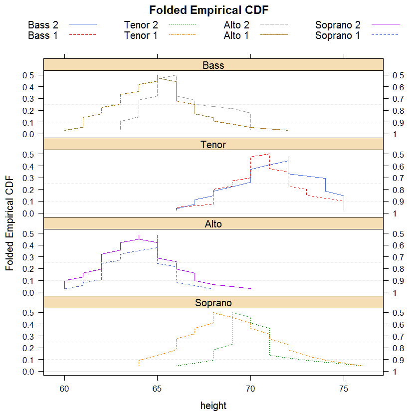

# mountainplot

[](https://cran.r-project.org/package=mountainplot)
[](http://depsy.org/package/r/mountainplot)

Key features:

* Extends lattice graphics to support multi-panel, multi-group mountainplots.

## Installation

```R
# Install the released version from CRAN:
install.packages("mountainplot")

# Install the cutting edge development version from GitHub:
install.packages("devtools")
devtools::install_github("kwstat/mountainplot")
```

## Usage

Vignette:
[Introduction to the mountainplot package](https://rawgit.com/kwstat/mountainplot/master/vignettes/mountainplot.html)

```R
require(mountainplot)
data(singer, package = "lattice")
parts <- within(singer, {
section <- voice.part
section <- gsub(" 1", "", section)
section <- gsub(" 2", "", section)
section <- factor(section)
})
# Change levels to logical ordering
levels(parts$section) <- c("Bass","Tenor","Alto","Soprano")
mountainplot(~height|section, data = parts,
             groups=voice.part, type='l',
             layout=c(1,4),
             main="Folded Empirical CDF",
             auto.key=list(columns=4), as.table=TRUE)
```

